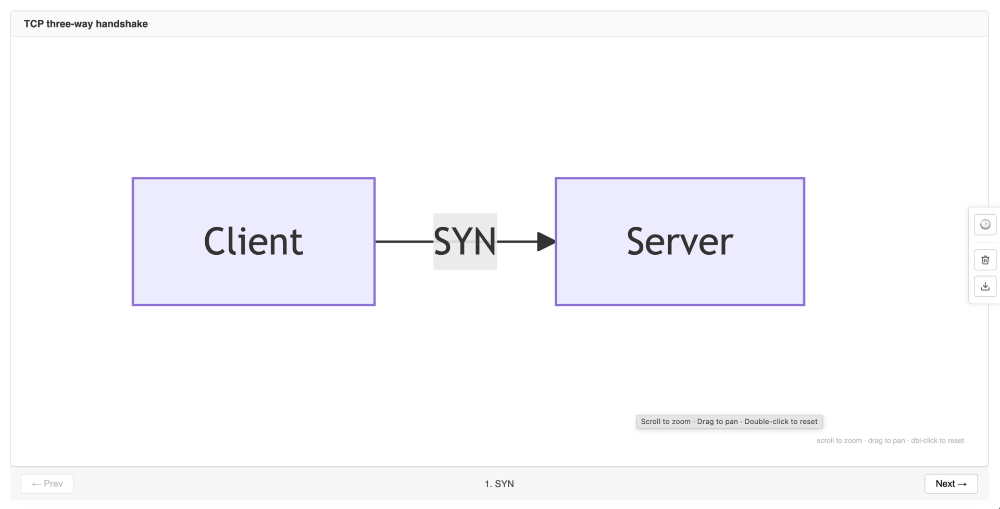
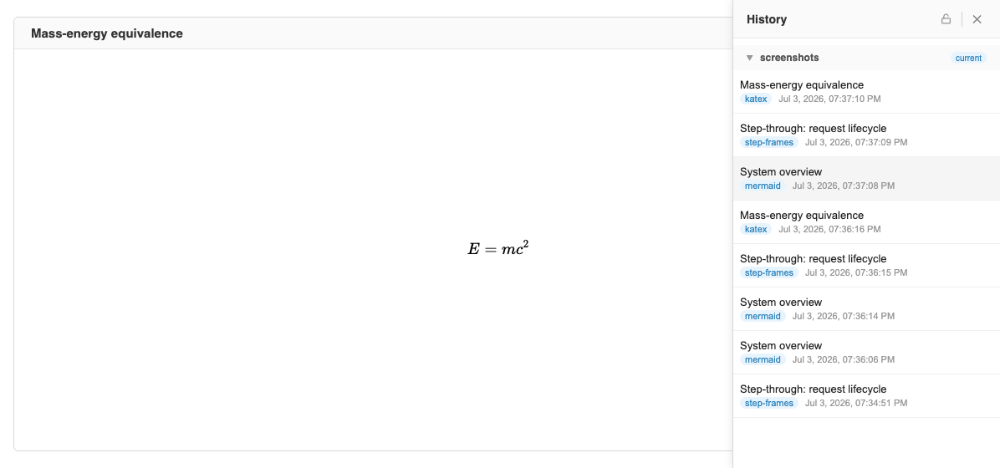
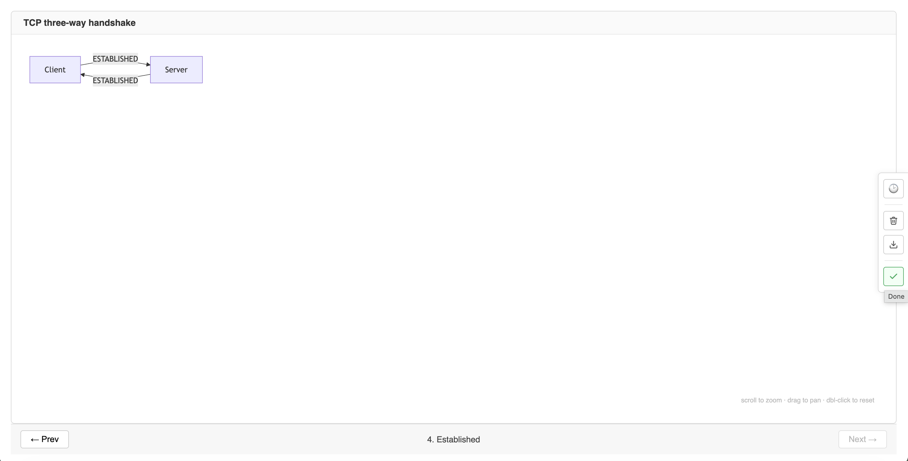
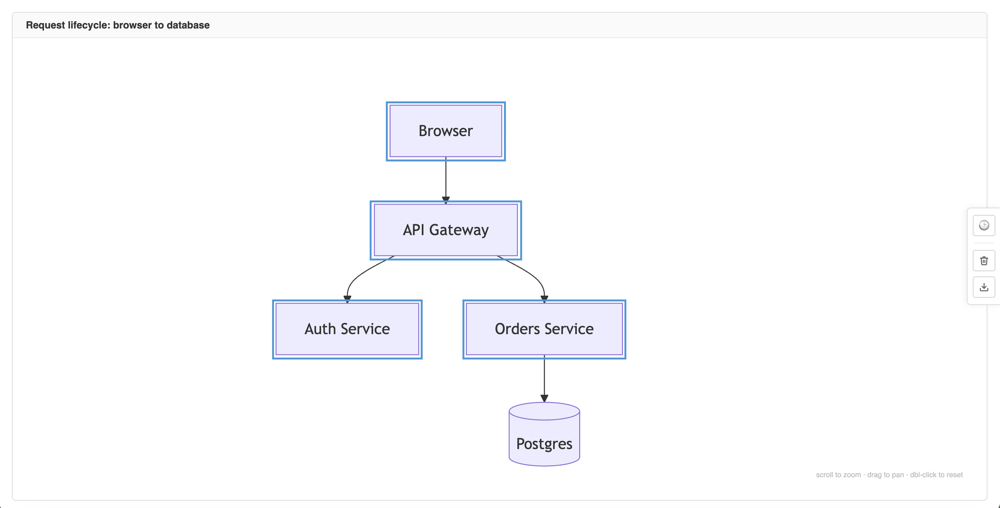
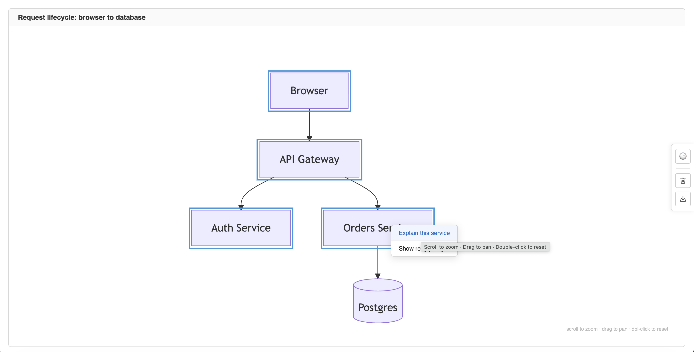
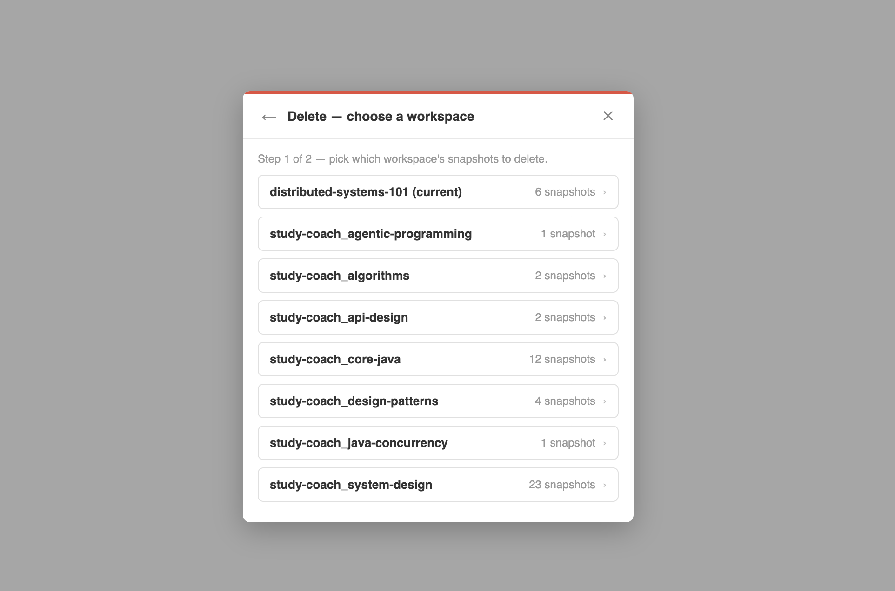
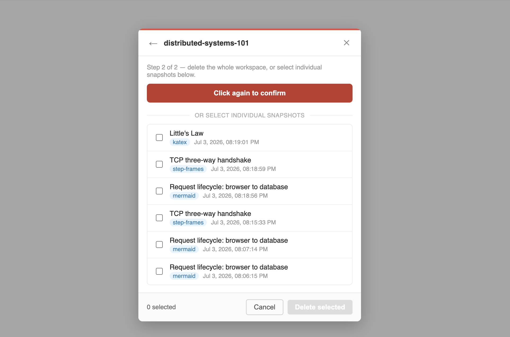
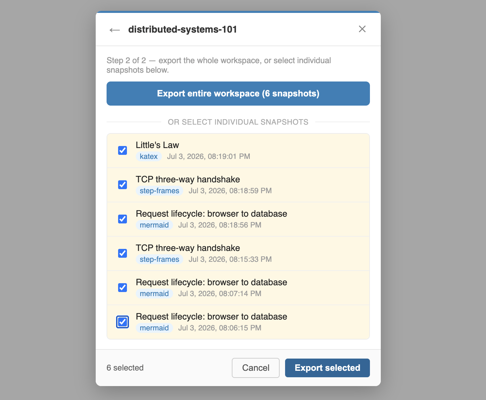
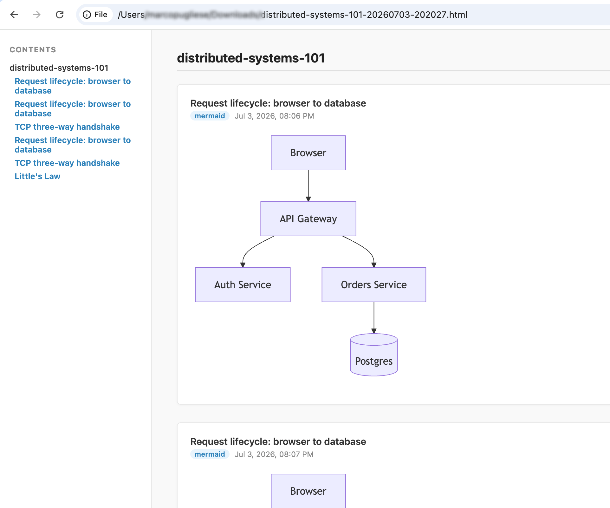

# Agent Whiteboard

A domain-agnostic interactive whiteboard for AI teacher agents. An AI agent renders diagrams, math, charts, and HTML to a local browser tab via MCP tools — and can pause to wait for the user to signal they're ready to continue.



The browser also has a History panel for browsing, reloading, deleting, and exporting past snapshots:



## How it works

```
[Claude Code agent]
    │
    └── 13 MCP tools — render, step-frames builder, slideshow, wait_click/wait_done, snapshot export (see below)
           │
           ▼
    [Node.js server :3000]  — MCP over SSE + REST fallback + WebSocket
           │
           ▼
    [Browser tab :5173]  — Svelte SPA, auto-opens on start, with a History panel for browsing/deleting/exporting past snapshots
```

The server exposes MCP tools over SSE at `http://localhost:3000/mcp`. Claude Code connects automatically when `.mcp.json` is present in the project root.

Every `render()`/commit call is persisted as a snapshot on disk (`~/.agent-whiteboard/<workspace>/`), so a lesson's diagram history survives past the current canvas state — see [History & snapshots](#history--snapshots).

## Requirements

- Node.js ≥ 18
- Claude Code (CLI or IDE extension)

## Quickstart

```bash
npx agent-whiteboard
```

This starts the server on `:3000` (serving the pre-built client — no separate dev server) and opens a browser tab automatically. Add `.mcp.json` (see [MCP registration](#mcp-registration)) so Claude Code connects to it.

By default the server only binds to loopback addresses (`localhost`/`127.0.0.1`/`::1`) — see [Trust model](#trust-model) below.

### Trust model

This is a **single-user, local-only** tool: there is no authentication on any endpoint. That's an accepted trade-off, not an oversight — the server refuses to start if `HOST` is set to anything other than a loopback address, unless you explicitly set `ALLOW_NON_LOOPBACK=1` (not recommended; anyone who can reach the port can render arbitrary content, read/delete your snapshot history, and exfiltrate exported data). Don't expose this server beyond your own machine.

## Development

Running from source (contributing, or testing an unreleased change) instead of `npx agent-whiteboard`:

```bash
npm install
npm run dev
```

This starts the Node server (`:3000`), the Vite dev server (`:5173`), and opens the browser tab automatically.

Enable the MCP server in Claude Code the first time:

```
/mcp
```

Select `agent-whiteboard` and enable it. The tools will be available immediately.

## Environment variables

| Variable                  | Default              | Description |
|----------------------------|-----------------------|-------------|
| `PORT`                     | `3000`                | Server port — serves the REST/MCP/WebSocket API, and (via `npx agent-whiteboard`) the built client too. |
| `HOST`                     | `localhost`           | Bind address. Must resolve to a loopback address (`localhost`, `127.0.0.1`, `::1`) — the server refuses to start otherwise unless `ALLOW_NON_LOOPBACK` is set. See [Trust model](#trust-model). |
| `ALLOW_NON_LOOPBACK`       | unset                 | Set to `1` to allow binding a non-loopback `HOST`. Not recommended — there is no authentication on any endpoint. |
| `WHITEBOARD_SNAPSHOTS_DIR` | `~/.agent-whiteboard` | Snapshot storage location. |
| `CHANNEL_PORT`             | `3001`                | Port for the stdio-channel HTTP relay used by Claude Code's channel forwarding (only relevant if Claude Code was started with channels enabled). |

**Port conflicts:** if `:3000` (or `:3001`/`:5173`, see below) is already in use on your machine, set `PORT` (and `CHANNEL_PORT` if needed) to a free port before starting.

> Dev-only (`npm run dev`, not `npx agent-whiteboard`): the Vite client dev server always runs on `:5173`, hardcoded in `client/vite.config.ts` — not currently configurable via an environment variable.

## MCP tools

### `render(type, payload[, options])`

Push content to the whiteboard canvas. Replaces whatever is currently on screen.

| `type` | `payload` |
|---|---|
| `"mermaid"` | Mermaid diagram source. Must begin with a valid keyword (`graph`, `flowchart`, `sequenceDiagram`, `classDiagram`, `erDiagram`, `gantt`, `pie`, `mindmap`). |
| `"svg"` | Inline SVG markup. |
| `"html"` | HTML/CSS fragment. Sanitized via DOMPurify — inline styles only; `<script>` and `<style>` tags are stripped. |
| `"katex"` | LaTeX string, rendered in display mode. |
| `"vega-lite"` | Vega-Lite JSON spec (must be valid JSON string). |

`render()` is single-frame only. For a step-through sequence (multiple frames navigable via `step()`/`seek()`), use [`init_step_frames`/`append_frame`/`commit_step_frames`](#init_step_framesframe_type-workspace-title) instead — see [Step-frames sequences](#step-frames-sequences).

`options`:
- `workspace` — **required.** Workspace name for snapshot routing (alphanumeric, dashes, underscores, dots, spaces — no path separators). Snapshots are written to `~/.agent-whiteboard/<workspace>/`. Missing or invalid workspace returns `{ "ok": false, "error": "..." }` without rendering.
- `title` — string label displayed above the canvas for this render call.

**Returns:** `{ "ok": true, "id": "<uuid>" }` — the UUID of the snapshot written for this call (`id` is omitted if the snapshot write fails, which is non-fatal). Error: `{ "ok": false, "error": "..." }`

### `step(direction)`

Advance (`"next"`) or rewind (`"prev"`) the step cursor for a loaded step-frames sequence.

**Returns:** `{ "ok": true, "current_frame": N, "total_frames": M }` or `{ "ok": false, "error": "..." }`

### `seek(frame)`

Jump the step-frame cursor to an arbitrary frame index without repeated `step()` calls.

**Returns:** `{ "ok": true, "current_frame": N, "total_frames": M }` or `{ "ok": false, "error": "..." }`

### `clear()`

Reset the canvas to a blank state.

**Returns:** `{ "ok": true }`

### `export([id])`

Return a canvas source payload.

- **Without `id`:** returns the current canvas state verbatim (last `render()` payload). For `step-frames`, returns the full original frames JSON. Returns an empty string if the canvas is blank.
- **With `id` (UUID):** scans all snapshot files for the one whose `id` field matches (written from v0.11 onward) and returns its payload. Old snapshots without an `id` field are not addressable this way.

**Returns:** `{ "ok": true, "data": "<source>" }` (without id: always succeeds; with id: `{ "ok": false, "error": "graph not found" }` if no match)

### `slideshow(slides, delay_ms)`

Load a playlist and auto-advance it on a server-side timer.

- `slides` — array of `{ type, payload, title? }` objects (same types as `render()`).
- `delay_ms` — interval in milliseconds between slides.

A new call cancels any running slideshow. Use `slideshow_stop()` to stop early.

**Returns:** `{ "ok": true }` or `{ "ok": false, "error": "..." }`

### `slideshow_stop()`

Cancel the running slideshow. The last rendered slide stays on screen. No-op if nothing is running.

**Returns:** `{ "ok": true }`

### `wait_done()`

Block until the user clicks the **Done** button in the browser tab, then return. Use this after `render()` when you want the user to review a diagram before the agent continues. Times out after 10 minutes.

**Returns:** `{ "ok": true }`



### `wait_click([node_actions])`

Arm the browser for a single node or edge click on the current Mermaid diagram. Nodes are highlighted with a blue outline and pointer cursor. Applies reliably to `graph`/`flowchart` diagrams; other types are best-effort.

`node_actions` (optional) — a map of node ID → string array. When provided, clicking a mapped node shows an inline popup menu listing the action strings; the selected item is returned in the `action` field. Nodes not in the map produce a plain click (`action: null`). Edge clicks are always plain.

Only one `wait_click()` may be pending at a time — a second `wait_click()` call, or an arming `wait_done()` call, supersedes it. Times out after 10 minutes.

**Returns:** `{ "ok": true, "type": "node"|"edge", "id": "<id>", "label": "<label>", "action": "<selected>" | null }` on click (`action` is the chosen menu item string, or `null` for a plain click); `{ "ok": true, "type": "timeout" }` on plain inactivity timeout; `{ "ok": true, "type": "superseded" }` when cancelled by a new arm.

| Armed — clickable nodes get a blue outline                                                                    | After clicking a node with `node_actions` registered                                                                              |
|---------------------------------------------------------------------------------------------------------------|-----------------------------------------------------------------------------------------------------------------------------------|
|  |  |

### `init_step_frames(frame_type, workspace, title?)`

Begin a step-frames sequence — this is the only way to create a multi-frame, step-through sequence (`render()` is single-frame only). Creates an empty builder in server memory, pushes a 0-frame placeholder to the browser, and returns a builder ID. Protocol: `init_step_frames()` → `append_frame()` × N → `commit_step_frames()`. The builder expires after 30 minutes of inactivity.

Each `append_frame()` call is validated and broadcast individually — interleave `wait_done()` after each one for a paced, user-acknowledged reveal (see [Example agent flow](#example-agent-flow)).

**Returns:** `{ "ok": true, "id": "<uuid>" }` or `{ "ok": false, "error": "..." }`

### `append_frame(id, payload, label?, type?)`

Append one frame to an in-progress builder. `payload` is validated against `type ?? frame_type` (same rules as `render()`). `type` (optional) overrides the sequence's `frame_type` for this one frame — lets a sequence mix content types (e.g. a mermaid frame followed by a katex frame). Each valid append immediately broadcasts the accumulated sequence to the browser, positioned at the latest frame — the user watches the step-through grow one frame at a time. Invalid payloads are rejected without touching prior frames or browser state.

**Returns:** `{ "ok": true, "frame_count": N }` or `{ "ok": false, "error": "..." }`

### `commit_step_frames(id, node_to_frame?)`

Finalize an in-progress builder: assembles the full step-frames JSON, writes a snapshot, updates canvas state (so `export()` and `step()`/`seek()` work on it), and deletes the builder entry. The browser already shows the sequence from `append_frame()` live previews.

`node_to_frame` (optional) — map of node ID → frame index. When set, clicking a mapped node in the browser jumps directly to its frame via `POST /seek` — no `wait_click()` call needed. Disabled for the duration of any `wait_click()` call, then automatically re-enabled once that call resolves or times out — no need to build and commit a new sequence just to restore it.

**Returns:** `{ "ok": true, "id": "<uuid>" }` or `{ "ok": false, "error": "..." }`

### `list_snapshots(workspace)`

List the snapshots stored for a workspace (`id`, `timestamp`, `type`, optional `title`), newest-first, so an agent can discover what's available to export via `export_html()` without going through the browser History panel. Returns an empty array if the workspace has no snapshots.

**Returns:** `{ "ok": true, "snapshots": [...] }`

### `export_html(workspace, ids)`

Export one or more snapshots (by UUID, discovered via `list_snapshots()`) to a single self-contained HTML document — the agent-facing equivalent of the browser History panel's "Export selected". Mermaid diagrams render client-side in the exported file; KaTeX/Vega-Lite/SVG/HTML render server-side. Dependencies (Mermaid, Bootstrap, KaTeX) are linked from a CDN (pinned version + SRI hash), which keeps the assembled HTML small enough to return **inline** as a string in the tool response — this tool has no filesystem access and never writes to disk. The resulting file needs network access to render correctly when opened. For a fully offline-capable export, or to save the file to a specific path, use `POST /export-html` with `{ "mode": "offline" }` instead (see REST fallback below).

**Returns:** `{ "ok": true, "path": "<absolute path>" }` or `{ "ok": false, "error": "..." }`

## Step-frames sequences

There is no one-shot way to render a multi-frame sequence — `render()` is single-frame only. Build one via `init_step_frames()` → `append_frame()` × N → `commit_step_frames()` (see above). Once committed, `export()` returns the assembled sequence in this shape:

```json
{
  "frame_type": "mermaid",
  "frames": [
    { "label": "Step 1", "payload": "graph TD; A" },
    { "label": "Step 2", "payload": "graph TD; A --> B" },
    { "label": "Step 3", "payload": "graph TD; A --> B --> C" }
  ]
}
```

## Example agent flow

```
render(type="mermaid", payload="graph TD; A --> B", options={ workspace: "my-lesson", title: "System overview" })
→ wait_done()   # agent pauses; user clicks Done when ready
→ render(type="katex", payload="E = mc^2", options={ workspace: "my-lesson" })
→ wait_done()
```

Paced, user-acknowledged reveal — interleave `wait_done()` between `append_frame()` calls so each frame waits for the user before the next one appears (useful for large or complex step-frames sequences the agent is building on the fly):

```
init_step_frames(frame_type="mermaid", workspace="my-lesson", title="TCP handshake")
→ append_frame(id, payload="graph LR; Client -- SYN --> Server", label="1. SYN")
→ wait_done()   # user reviews frame 1, clicks Done
→ append_frame(id, payload="graph LR; Client -- SYN --> Server; Server -- SYN-ACK --> Client", label="2. SYN-ACK")
→ wait_done()   # user reviews frame 2, clicks Done
→ append_frame(id, payload="...", label="3. ACK")
→ commit_step_frames(id)
```

`wait_done()` isn't coupled to step-frames — it just blocks on the Done button — so this pattern works with any number of frames and needs no dedicated tool support.

## REST fallback

All tools have HTTP equivalents for scripting or testing without an MCP client:

| Endpoint | Body / Params |
|---|---|
| `POST /render` | `{ "type": "...", "payload": "...", "options": { "workspace": "...", "title": "..." } }` — `workspace` required. Returns `{ "ok": true, "id": "<uuid>" }` on success. |
| `POST /step` | `{ "direction": "next" \| "prev" }` |
| `POST /clear` | — |
| `GET /export` | No params: returns current canvas. `?id=<uuid>`: returns matching snapshot payload (404 if not found). |
| `POST /slideshow` | `{ "slides": [...], "delay_ms": N }` |
| `POST /slideshow/stop` | — |
| `POST /seek` | `{ "frame": N }` |
| `POST /user-done` | — (simulates the Done button click) |
| `POST /wait-done` | — (long-polls until Done is signalled) |
| `POST /node-click` | `{ "type": "node"\|"edge", "id": "...", "label": "..." }` (sent by browser) |
| `POST /wait-click` | `{ "node_actions": { "<id>": ["action1", ...] } }` (optional; long-polls until a node/edge click is signalled) |
| `POST /step-frames/init` | `{ "frame_type": "...", "workspace": "...", "title": "..." }` — starts an incremental builder, returns `{ "ok": true, "id": "<uuid>" }` |
| `POST /step-frames/:id/frame` | `{ "payload": "...", "label": "...", "type": "..." }` (`type` optional, overrides the sequence's `frame_type`) — appends a frame, returns `{ "ok": true, "frame_count": N }` |
| `POST /step-frames/:id/commit` | `{ "node_to_frame": { "<id>": N, ... } }` (optional body) — finalizes the builder, returns `{ "ok": true, "id": "<uuid>" }` |
| `GET /snapshots` | `?workspace=` **required**, no fallback — lists that workspace's snapshots (REST equivalent of the MCP `list_snapshots` tool) |
| `GET /snapshots/all` | Lists every workspace and its snapshot count, current workspace flagged with `isCurrent: true` |
| `POST /snapshots/load` | `{ "filename": "..._screen.json", "workspace": "..." (optional) }` — loads a past snapshot onto the canvas (write-silent, no new snapshot is created) |
| `POST /snapshots/delete-files` | `{ "workspace": "...", "filenames": ["..._screen.json", ...] }` — deletes specific snapshot files |
| `POST /snapshots/delete-workspace` | `{ "workspace": "..." }` — deletes an entire workspace's snapshot folder |
| `POST /export-html` | `{ "items": [{ "workspace": "...", "id": "..." }, ...], "mode": "cdn" \| "offline" }` (`mode` optional, defaults to `"cdn"`) — returns the assembled HTML file as a download, not JSON |

All endpoints return the same JSON shapes as the MCP tools, except `POST /export-html`, which streams the HTML file directly (`Content-Disposition: attachment`). `mode: "cdn"` (default) links Mermaid/Bootstrap/KaTeX from a CDN; `mode: "offline"` embeds them for offline reading, at the cost of a much larger file (the Mermaid bundle alone is ~3.3MB).

## History & snapshots

Every `render()` / `commit_step_frames()` call writes a JSON snapshot to `~/.agent-whiteboard/<workspace>/` (override with the `WHITEBOARD_SNAPSHOTS_DIR` environment variable). The browser's right-side controls panel has a history toggle that opens a panel for browsing and loading past snapshots grouped by workspace, plus delete and export icon buttons that open a 2-step modal (`client/src/DeleteExportModal.svelte`) for deleting or exporting an entire workspace or a chosen subset of snapshots. Destructive actions require a second confirming click. Exports are produced by the `export_html()` tool / `POST /export-html` endpoint described above.

| Step 1 — choose a workspace                                                                                                                  | Step 2 — delete requires a second confirming click                                                                                    |
|----------------------------------------------------------------------------------------------------------------------------------------------|---------------------------------------------------------------------------------------------------------------------------------------|
|  |  |

| Step 2 — export a subset of snapshots                                                                          | The resulting self-contained HTML, opened directly in a browser |
|----------------------------------------------------------------------------------------------------------------|---|
|  |  |

## Manual showcase

Exercises every renderer and interactive feature (requires `npm run dev` running):

```bash
node tests/human_driven/showcase.js        # Sections 1–8: renderer slideshow + seek
node tests/human_driven/showcase.js -x    # Section 12: export-by-id (v0.11)
node tests/human_driven/showcase.js -a    # All sections
```

Section flags (combinable):

```
-s, --standard        Sections 1–8: renderer slideshow + seek demo (default)
-i, --interactive     Section 9:  node click drill-down + Done button
-u, --popup           Section 10: node_actions popup menu
-e, --edge            Section 11: edge click demo
-x, --exportid        Section 12: export by graph ID (v0.11)
-a, --all             All sections
-p, --port <port>     Server port (default: 3000)
-d, --delay <ms>      Delay between slides (default: 5000)
```

## Tests

```bash
npm test          # Vitest unit/integration tests (server)
npm run test:e2e  # Playwright end-to-end tests (requires npm run dev:test first)
```

## MCP registration

`.mcp.json` is committed to the repo root and picked up automatically by Claude Code:

```json
{
  "mcpServers": {
    "agent-whiteboard": {
      "type": "sse",
      "url": "http://localhost:3000/mcp"
    }
  }
}
```

The server must be running before Claude Code connects. If you override `PORT`, update the URL above to match. See [Environment variables](#environment-variables) for the full list of overridable settings.
